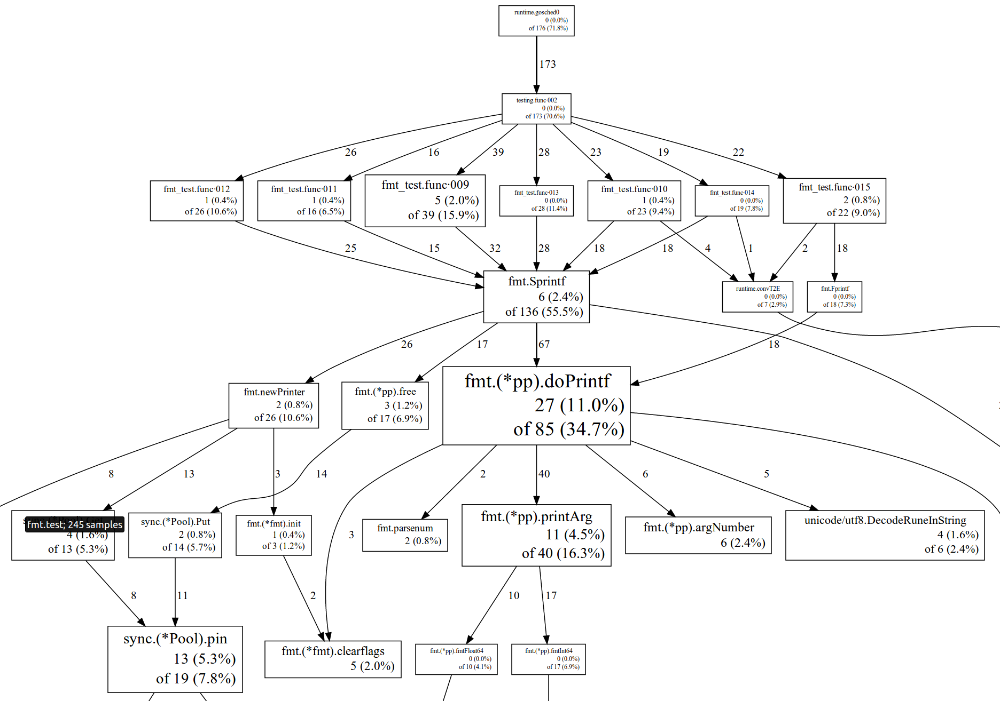

[原文](https://software.intel.com/en-us/blogs/2014/05/10/debugging-performance-issues-in-go-programs)

##简介
需要debugGo程序来找到问题，定位问题，比如找hotspot(CPU,MEMORY,IO,etc),SQL问题，代码问题(可以更快更简单)

下面会介绍一些工具来达到目的

##CPU
Go runtime内嵌了CPU profiler, 显示CPU占用时间比例，有3个方法
1. 最简单,go test的-cpuprofile flag
```text
$ go test -run=none -bench=ClientServerParallel4 -cpuprofile=cprof net/http
``` 
会把benchmark和产生的CPU profile存放到cprof文件
然后可以通过
```text
$ go tool pprof --text http.test cprof
```
会打印CPU的hottest functions
其他可选的option包括 --web , --list 
唯一的缺点是，这些只支持test

2. net/http/pprof 包，对于网络应用最理想的方式，只需要import包，然后collect就可以了
```text
$ go tool pprof --text mybin http://myserver:6060:/debug/pprof/profile

```
3. 人工profile收集. import runtime/pprof，然后添加代码到main
```go
if *flagCpuprofile != "" {
    f, err := os.Create(*flagCpuprofile)
    if err != nil {
        log.Fatal(err)
    }
    pprof.StartCPUProfile(f)
    defer pprof.StopCPUProfile()
}
```
可以写到特定的文件，用同样的go tool pprof 可以查看
pprof的可视化例子
选项 --list=functionName 可以查看某个func的耗时
解决cpu func问题的一些hits:
* runtime.mallocgc方法耗时长，证明程序分配了很多小的空间，看看哪里产生的小对象
* channel操作，sync.Mutext,其他同步操作耗时长，系统资源竞争激烈，考虑重构，处理共享资源，通常sharding/partitioning,local buffering
/batching, copy-on-write等手段
* syscall.Read/Write耗时长,程序可能有很多小的文件读写，尝试用bufio包的缓存
* GC时间长，可能的问题是分配对象太多，heap设置过小等

##Memory
显示方法对于heap的占用情况
使用: go test --memprofile , net/http/pprof http://myserver:6060/debug/pprof/heap 查看，使用 runtime/pprof.WriteHeapProfile


