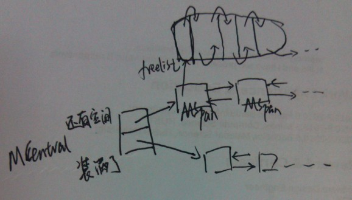

##内存池
Go的内存分配器采用了跟tcmalloc库相同的实现，是一个带内存池的分配器，底层直接调用操作系统的mmap等函数。
作为一个内存池，回忆一下跟它相关的基本部分。首先，它会向操作系统申请大块内存，自己管理这部分内存。然后，它是一个池子，当上层释放内存时它不实际归还给操作系统，而是放回池子重复利用。
接着，内存管理中必然会考虑的就是内存碎片问题，如果尽量避免内存碎片，提高内存利用率
另外，Go是一个支持goroutine这种多线程的语言，所以它的内存管理系统必须也要考虑在多线程下的稳定性和效率问题

在多线程方面，很自然的做法就是每条线程都有自己的本地的内存，然后有一个全局的分配链，当某个线程中内存不足后就向全局分配链中申请内存。这样就避免了多线程同时访问共享变量时的加锁
在避免内存碎片方面，大块内存直接按页为单位分配，小块内存会切成各种不同的固定大小的块，申请做任意字节内存时会向上取整到最接近的块，将整块分配给申请者以避免随意切割

Go中为每个系统线程分配一个本地的MCache(前面介绍的结构体M中的MCache域)，少量的地址分配就直接从MCache中分配，并且定期做垃圾回收，将线程的MCache中的空闲内存返回给全局控制堆
小于32K为小对象，大对象直接从全局控制堆上以页(4k)为单位进行分配，也就是说大对象总是以页对齐的
一个页可以存入一些相同大小的小对象，小对象从本地内存链表中分配，大对象从中心内存堆中分配

大约有100种内存块类别，每一类别都有自己对象的空闲链表。小于32kB的内存分配被向上取整到对应的尺寸类别，从相应的空闲链表中分配。一页内存只可以被分裂成同一种尺寸类别的对象，然后由空闲链表分配器管理
分配器的数据结构包括:
FixAlloc: 固定大小(128kB)的对象的空闲链分配器,被分配器用于管理存储
MHeap: 分配堆,按页的粒度进行管理(4kB)
MSpan: 一些由MHeap管理的页
MCentral: 对于给定尺寸类别的共享的free list
MCache: 用于小对象的每M一个的cache

__内存管理看成一个两级的内存管理结构，MHeap和MCache。上面一级管理的基本单位是页，用于分配大对象，每次分配都是若干连续的页，也就是若干个4KB的大小。使用的数据结构是MHeap和MSpan，用BestFit算法做分配，用位示图做回收。
下面一级管理的基本单位是不同类型的固定大小的对象，更像一个对象池而不是内存池，用引用计数做回收。下面这一级使用的数据结构是MCache__ 

###MHeap
MHeap层次用于直接分配较大(>32kB)的内存空间，以及给MCentral和MCache等下层提供空间。它管理的基本单位是MSpan。MSpan是一个表示若干连续内存页的数据结构，简化后如下：
1.9 mheap.go //TODO read
```go
type mspan struct {
	next *mspan     // next span in list, or nil if none
	prev *mspan     // previous span in list, or nil if none
	list *mSpanList // For debugging. TODO: Remove.

	startAddr uintptr // address of first byte of span aka s.base()
	npages    uintptr // number of pages in span
	...
	}
```
MHeap负责将MSpan组织和管理起来，MHeap数据结构中的重要部分如图所示

free是一个分配池，从free[i]出去的MSpan每个大小都i页的,总共256个槽位。再大了之后，大小就不固定了，由large链起来
* 分配过程：   
如果能从free[]的分配池中分配，则从其中分配。如果发生切割则将剩余部分放回free[]中。比如要分配2页大小的空间，
从图上2号槽位开始寻找，直到4号槽位有可用的MSpan，则拿一个出来，切出两页，剩余的部分再放回2号槽位中。 
否则从large链表中去分配，按BestFit算法去找一块可用空间
化整为零简单，化零为整麻烦。回收的时候如果相邻的块是未使用的，要进行合并，否则一直划分下去就会产生很多碎片，
找不到一个足够大小的连续空间。因为涉及到合并，回收会比分配复杂一些，所有就有什么伙伴算法，边界标识算法，位示图之类的。

###MCache
MCache层次跟MHeap层次非常像，也是一个分配池，对每个尺寸的类别都有一个空闲对象的单链表。Go的内存管理可以看成一个两级的层次，上面一级是MHeap层次，而MCache则是下面一级
1.9 runtime/mcache.go //TODO read
__每个M都有一个自己的局部内存缓存MCache，这样分配小对象的时候直接从MCache中分配，就不用加锁了，这是Go能够在多线程环境中高效地进行内存分配的重要原因。MCache是用于小对象的分配__ 
分配一个小对象(<32kB)的过程：
* 将小对象大小向上取整到一个对应的尺寸类别，查找相应的MCache的空闲链表。如果链表不空，直接从上面分配一个对象。这个过程可以不必加锁。
* 如果MCache自由链是空的,通过从MCentral自由链拿一些对象进行补充。
* 如果MCentral自由链是空的,则通过MHeap中拿一些页对MCentral进行补充，然后将这些内存截断成规定的大小。
* 如果MHeap是空的,或者没有足够大小的页了,从操作系统分配一组新的页(至少1MB)。分配一大批的页分摊了从操作系统分配的开销。
释放一个小对象也是类似的过程:
* 查找对象所属的尺寸类别，将它添加到MCache的自由链。
* 如果MCache自由链太长或者MCache内存大多了，则返还一些到MCentral自由链。
* 如果在某个范围的所有的对象都归还到MCentral链了，则将它们归还到页堆。
归还到MHeap就结束了，目前还是没有归还到操作系统

MCache层次仅用于分配小对象，分配和释放大的对象则是直接使用MHeap的，跳过MCache和MCentral自由链。
MCache和MCentral中自由链的小对象可能是也可能不是清0了的。对象的第2个字节作为标记，当它是0时，此对象是清0了的。页堆中的总是清零的，当一定范围的对象归还到页堆时，需要先清零。
这样才符合Go语言规范：分配一个对象不进行初始化，它的默认值是该类型的零值

###MCentral
MCentral层次是作为MCache和MHeap的连接。对上，它从MHeap中申请MSpan；对下，它将MSpan划分成各种小尺寸对象，提供给MCache使用
1.9 runtime/mcentral.go //TODO read
```go
type mcentral struct {
	lock      mutex
	spanclass spanClass
	nonempty  mSpanList // list of spans with a free object, ie a nonempty free list
	empty     mSpanList // list of spans with no free objects (or cached in an mcache)

	// nmalloc is the cumulative count of objects allocated from
	// this mcentral, assuming all spans in mcaches are
	// fully-allocated. Written atomically, read under STW.
	nmalloc uint64
}
```
注意，每个MSpan只会分割成同种大小的对象。每个MCentral也是只含同种大小的对象。MCentral结构中，有一个nonempty的MSpan链和一个empty的MSpan链，分别表示还有空间的MSpan和装满了对象的MSpan
如图所示： 

分配还是很简单，直接从MCentral->nonempty->freelist分配。如果发现freelist空了，则说明这一块MSpan满了，将它移到MCentral->empty。 前面说过，回收比分配复杂，因为涉及到合并。这里的合并是通过引用计数实现的。
从MSpan中每划出一个对象，则引用计数加一，每回收一个对象，则引用计数减一。如果减完之后引用计数为零了，则说明这整块的MSpan已经没被使用了，可以将它归还给MHeap

本节的内存池涉及的文件包括：
malloc.h 头文件
malloc.goc 最外层的包装
msize.c 将各种大小向上取整到相应的尺寸类别
mheap.c 对应MHeap中相关实现,还有MSpan
mcache.c 对应MCache中相关实现
mcentral.c 对应MCentral中相关实现
mem_linux.c SysAlloc等sys相关的实现

##垃圾回收
Go语言中使用的垃圾回收使用的是标记清扫算法。进行垃圾回收时会stoptheworld
在当前1.3版本中，实现了精确的垃圾回收和并行的垃圾回收，大大地提高了垃圾回收的速度，进行垃圾回收时系统并不会长时间卡住 //TODO 关注1.10的最新垃圾回收
###标记清扫算法
标记清扫算法是一个很基础的垃圾回收算法，该算法中有一个标记初始的root区域，以及一个受控堆区。root区域主要是程序运行到当前时刻的栈和全局数据区域。在受控堆区中，很多数据是程序以后不需要用到的，这类数据就可以被当作垃圾回收了。
判断一个对象是否为垃圾，就是看从root区域的对象是否有直接或间接的引用到这个对象。如果没有任何对象引用到它，则说明它没有被使用，因此可以安全地当作垃圾回收掉

标记清扫算法分为两阶段：标记阶段和清扫阶段。标记阶段，从root区域出发，扫描所有root区域的对象直接或间接引用到的对象，将这些对上全部加上标记。在回收阶段，扫描整个堆区，对所有无标记的对象进行回收

###位图标记和内存布局
既然垃圾回收算法要求给对象加上垃圾回收的标记，显然是需要有标记位的,一般的做法会将对象结构体中加上一个标记域，一些优化的做法会利用对象指针的低位进行标记
Go没有这么做，__它的对象和C的结构体对象完全一致，使用的是非侵入式的标记位__
堆区域对应了一个标记位图区域，堆中每个字(不是byte，而是word)都会在标记位区域中有对应的标记位
每个机器字(32位或64位)会对应4位的标记位。因此，64位系统中相当于每个标记位图的字节对应16个堆中的字节
虽然是一个堆字节对应4位标记位，但标记位图区域的内存布局并不是按4位一组，而是16个堆字节为一组，将它们的标记位信息打包存储的。每组64位的标记位图从上到下依次包括:
```text
16位的 特殊位 标记位
16位的 垃圾回收 标记位
16位的 无指针/块边界 的标记位
16位的 已分配 标记位
```
这样设计使得对一个类型的相应的位进行遍历很容易

前面提到堆区域和堆地址的标记位图区域是分开存储的，其实它们是以mheap.arena_start地址为边界，向上是实际使用的堆地址空间，向下则是标记位图区域。以64位系统为例，计算堆中某个地址的标记位的公式如下
```text
偏移 = 地址 - mheap.arena_start
标记位地址 = mheap.arena_start - 偏移/16 - 1
移位 = 偏移 % 16
标记位 = *标记位地址 >> 移位
```
然后就可以通过 (标记位 & 垃圾回收标记位),(标记位 & 分配位),等来测试相应的位。其中已分配的标记为1<<0,无指针/块边界是1<<16,垃圾回收的标记位为1<<32,特殊位1<<48

###精确的垃圾回收
标记清扫是保守的，“保守”是因为它们没办法获取对象类型信息，因此只能保守地假设地址区间中每个字都是指针
go从1.1开始支持精准GC
精确的垃圾回收首先需要的就是类型信息
MSpan结构体，类型信息是存储在MSpan中的。从一个地址计算它所属的MSpan，公式如下：
```text
页号 = (地址 - mheap.arena_start) >> 页大小
MSpan = mheap->map[页号]
```
接下来通过MSpan->type可以得到分配块的类型。这是一个MType的结构体：
```go
	struct MTypes
	{
		byte	compression;	// one of MTypes_*
		bool	sysalloc;	// whether (void*)data is from runtime·SysAlloc
		uintptr	data;
	};
```
PS: 1.9中已经找不到这个MTypes, 需要看看1.9最新的GC方式
MTypes描述MSpan里分配的块的类型，其中compression域描述数据的布局。它的取值为MTypes_Empty，MTypes_Single，MTypes_Words，MTypes_Bytes四个中的一种。
```text
MTypes_Empty:
	所有的块都是free的，或者这个分配块的类型信息不可用。这种情况下data域是无意义的。
MTypes_Single:
	这个MSpan只包含一个块，data域存放类型信息，sysalloc域无意义
MTypes_Words:
	这个MSpan包含多个块(块的种类多于7)。这时data指向一个数组[NumBlocks]uintptr,，数组里每个元素存放相应块的类型信息
MTypes_Bytes:
	这个MSpan中包含最多7种不同类型的块。这时data域指下面这个结构体
	struct {
		type  [8]uintptr       // type[0] is always 0
		index [NumBlocks]byte
	}
	第i个块的类型是data.type[data.index[i]]
```
表面上看MTypes_Bytes好像最复杂，其实这里的复杂程度是MTypes_Empty小于MTypes_Single小于MTypes_Bytes小于MTypes_Words的。MTypes_Bytes只不过为了做优化而显得很复杂

##垃圾回收
目前Go中垃圾回收的核心函数是scanblock，源代码在文件runtime/mgc0.c中(1.9 runtime/mgc.go)
上面有两个大的循环，外层循环作用是扫描整个内存块区域，将类型信息提取出来，得到其中的gc域。内层的大循环是实现一个状态机，解析执行类型信息中gc域的指令码
MType中的数据其实是类型信息，但它是用uintptr表示，而不是Type结构体的指针，这是一个优化的小技巧。由于内存分配是机器字节对齐的，所以地址就只用到了高位，低位是用不到的。于是低位可以利用起来存储一些额外的信息。这里的uintptr中高位存放的是Type结构体的指针，低位用来存放类型。通过
```text
	t = (Type*)(type & ~(uintptr)(PtrSize-1));
```
就可以从uintptr得到Type结构体指针，而通过
```text
    type & (PtrSize-1)
```
就可以得到类型。这里的类型有TypeInfo_SingleObject，TypeInfo_Array，TypeInfo_Map，TypeInfo_Chan几种

###基本标记过程
从最简单的开始看，基本的标记过程，有一个不带任何优化的标记的实现，对应于函数debug_scanblock
debug_scanblock函数是递归实现的，单线程的，更简单更慢的scanblock版本。该函数接收的参数分别是一个指针表示要扫描的地址，以及字节数。
```text
首先要将传入的地址，按机器字节大小对齐。
然后对待扫描区域的每个地址：
找到它所属的MSpan，将地址转换为MSpan里的对象地址。
根据对象的地址，找到对应的标记位图里的标记位。
判断标记位，如果是未分配则跳过。否则加上特殊位标记(debug_scanblock中用特殊位代码的mark位)完成标记。
判断标记位中标记了无指针标记位，如果没有，则要递归地调用debug_scanblock。
```
###并行GC
Go在这个版本中不仅实现了精确的垃圾回收，而且实现了并行的垃圾回收。标记算法本质上就是一个树的遍历过程，上面实现的是一个递归版本。
并行的垃圾回收需要做的第一步，就是先将算法做成非递归的。非递归版本的树的遍历需要用到一个队列。树的非递归遍历的伪代码大致是：
```text
根结点进队
while(队列不空) {
	出队
	访问
	将子结点进队
}
```
第二步是使上面的代码能够并行地工作，显然这时是需要一个线程安全的队列的。假设有这样一个队列，那么上面代码就能够工作了。但是，如果不加任何优化，这里的队列的并行访问非常地频繁，对这个队列加锁代价会非常高，即使是使用CAS操作也会大大降低效率
第三步要做的就是优化上面队列的数据结构。事实上，Go中并没有使用这样一个队列，为了优化，它通过三个数据结构共同来完成这个队列的功能，这三个数据结构分别是PtrTarget数组，Workbuf，lfstack
先说Workbuf吧。听名字就知道，这个结构体的意思是工作缓冲区，里面存放的是一个数组，数组中的每个元素都是一个待处理的结点，也就是一个Obj指针。这个对象本身是已经标记了的，这个对象直接或间接引用到的对象，都是应该被标记的，它们不会被当作垃圾回收掉。Workbuf是比较大的，一般是N个内存页的大小(目前是2页，也就是8K)
PtrTarget数组也是一个缓冲区，相当于一个intermediate buffer，跟Workbuf有一点点的区别。第一，它比Workbuf小很多，大概只有32或64个元素的数组。第二，Workbuf中的对象全部是已经标记过的，而PtrTarget中的元素可能是标记的，也可能是没标记的。第三，PtrTarget里面的元素是指针而不是对象，指针是指向任意地址的，而对象是对齐到正确地址的。从一个指针变为一个对象要经过一次变换，上一节中有讲过具体细节
垃圾回收过程中，会有一个从PtrTarget数组冲刷到Workbuf缓冲区的过程。对应于源代码中的flushptrbuf函数，这个函数作用就是对PtrTaget数组中的所有元素，如果该地址是mark了的，则将它移到Workbuf中。标记过程形成了一个环，在环的一边，对Workbuf中的对象，会将它们可能引用的区域全部放到PtrTarget中记录下来。在环的另一边，又会将PtrTarget中确定需要标记的地址刷到Workbuf中。这个过程一轮一轮地进行，推动非递归版本的树的遍历过程，也就是前面伪代码中的出队，访问，子结点进队的过程
另一个数据结构是lfstack，这个名字的意思是lock free栈。其实它是被用作了一个无锁的链表，链表结点是以Workbuf为单位的。并行垃圾回收中，多条线程会从这个链表中取数据，每次以一个Workbuf为工作单位。同时，标记的过程中也会产生Workbuf结点放到链中。lfstack保证了对这个链的并发访问的安全性。由于现在链表结点是以Workbuf为单位的，所以保证整体的性能，lfstack的底层代码是用CAS操作实现的。
经过第三步中数据结构上的拆解，整个并行垃圾回收的架构已经呼之欲出了，这就是标记扫描的核心函数scanblock。这个函数是在多线程下并行安全的。
那么，最后一步，多线程并行。整个的gc是以runtime.gc函数为入口的，它实际调用的是gc。进入gc函数后会先stoptheworld，接着添加标记的root区域。然后会设置markroot和sweepspan的并行任务。运行mark的任务，扫描块，运行sweep的任务，最后starttheworld并切换出去

###回收时机
垃圾回收的触发是由一个gcpercent的变量控制的，当新分配的内存占已在使用中的内存的比例超过gcprecent时就会触发。比如，gcpercent=100，当前使用了4M的内存，那么当内存分配到达8M时就会再次gc。如果回收完毕后，内存的使用量为5M，那么下次回收的时机则是内存分配达到10M的时候。也就是说，并不是内存分配越多，垃圾回收频率越高，这个算法使得垃圾回收的频率比较稳定，适合应用的场景。
gcpercent的值是通过环境变量GOGC获取的，如果不设置这个环境变量，默认值是100。如果将它设置成off，则是关闭垃圾回收。


